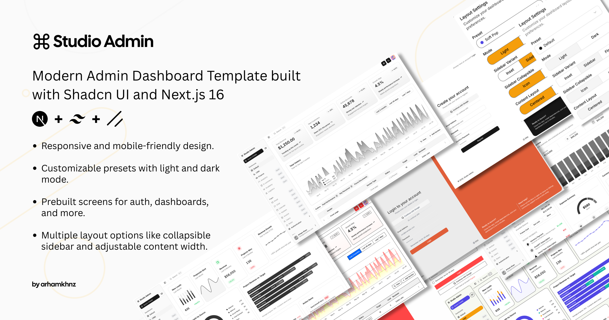

# BuildSense

**Digital Building Compliance for Australian Construction**

BuildSense is an intelligent compliance app that helps builders, designers, and certifiers instantly check whether construction details comply with the Australian National Construction Code (NCC).



## Features

- 🏗️ **Project Management** - Create projects with automatic climate zone, wind region, and bushfire detection
- 📋 **Smart Checklists** - Stage-specific compliance checklists linked to NCC clauses
- 📸 **Evidence Capture** - Photo documentation with timestamps and geo-tagging
- 🔍 **NCC Search** - Intelligent search through NCC requirements
- 🤖 **AI Copilot** - Ask compliance questions with citation-backed answers
- 🗺️ **Zone Lookup** - Climate zones, wind regions, and bushfire-prone areas

## Tech Stack

- **Framework**: Next.js 16 (App Router), TypeScript
- **Styling**: Tailwind CSS v4, shadcn/ui
- **Database**: Supabase (PostgreSQL + Auth + RLS)
- **Storage**: Cloudflare R2 (S3-compatible)
- **Deployment**: Vercel

## Getting Started

### Prerequisites

- Node.js 18+
- npm or pnpm
- Supabase account
- Cloudflare account (for R2 storage)

### Installation

1. **Clone the repository**

```bash
git clone https://github.com/elyasalemi1039/BuildSense.git
cd BuildSense
```

2. **Install dependencies**

```bash
npm install
```

3. **Set up environment variables**

```bash
cp .env.example .env.local
```

Edit `.env.local` with your Supabase and Cloudflare R2 credentials.

4. **Run the development server**

```bash
npm run dev
```

Open [http://localhost:3000](http://localhost:3000) in your browser.

## Environment Variables

| Variable | Description |
|----------|-------------|
| `NEXT_PUBLIC_SUPABASE_URL` | Your Supabase project URL |
| `NEXT_PUBLIC_SUPABASE_ANON_KEY` | Your Supabase anonymous key |
| `R2_ACCOUNT_ID` | Cloudflare account ID |
| `R2_ACCESS_KEY_ID` | R2 API access key ID |
| `R2_SECRET_ACCESS_KEY` | R2 API secret access key |
| `R2_BUCKET_NAME` | R2 bucket name (default: buildsense-files) |

## Project Structure

```
src/
├── app/                    # Next.js App Router pages
│   ├── (main)/            # Main app routes (dashboard, etc.)
│   └── globals.css        # Global styles with BuildSense theme
├── components/            # Reusable UI components
│   └── ui/               # shadcn/ui components
├── lib/
│   ├── supabase/         # Supabase client configuration
│   └── storage/          # Cloudflare R2 storage utilities
├── navigation/           # Sidebar navigation configuration
├── styles/
│   └── presets/          # Theme presets (BuildSense, etc.)
└── types/                # TypeScript type definitions
```

## License

MIT License - see [LICENSE](LICENSE) for details.


